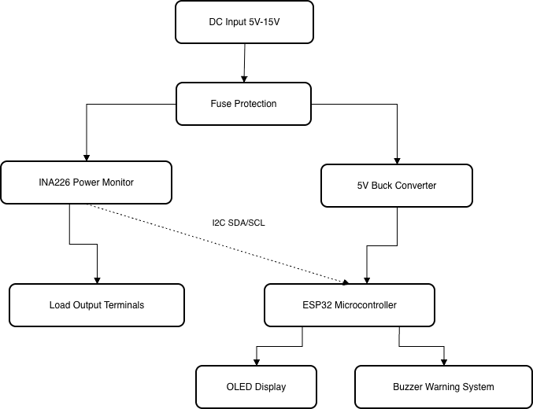

# Supply_Power_Monitor

## Overview

Battery_Power_Monitor is an ESP32-based DC inline power monitor designed to measure voltage, current, and power while a DC source powers an external load.

The system is designed to support a wide range of DC input sources from 6 V to 12 V and aims to act as a compact monitoring tool for electronics development and testing.

---

## Project Goals

Through this project I aim to learn:

- PCB design using KiCad
- Circuit testing and calibration
- ESP32 microcontroller development
- Embedded systems programming using C++
- Professional project documentation using GitHub
- Power monitoring and sensor integration

---

## Components Used

- ESP32 Development Board
- INA226 Power Monitoring Sensor
- 128x64 I2C OLED Display
- 6 V buck-boost converter module for powering the ESP32 from a 6–12 V input
- Screw Terminals
- Electrolytic and Ceramic Capacitors
- Fuse Protection

---

## How It Works

An external DC power source between 6 V and 12 V is connected through screw terminals.

The input power is split into two sections:

- A regulated 6 V supply powers the ESP32 and OLED display
- The main power line passes through the INA226 current and voltage sensor before reaching the external load

The INA226 measures:

- Bus Voltage
- Current Draw
- Power Consumption

The ESP32 processes this data and displays the measured values on the OLED screen.

The device is intended to help monitor power usage, diagnose faults, and test small electronics projects safely.

---

## System Diagram



### Power Flow

```text
DC Input (6 V - 12 V)
        │
        ├──→ LM2596S Buck Converter (5 V)
        │          │
        │          └──→ ESP32 ──→ OLED Display
        │                        └──→ Buzzer Warning
        │                        └──→ LED Warning
        └──→ Fuse Protection
                   │
                   └──→ INA226 Power Monitor
                                │
                                └──→ Load Output
```
## Current Status

The breadboard prototype is now working. The ESP32 successfully reads bus voltage and shunt voltage from the INA226 power monitoring sensor and displays voltage, current, and power on the OLED display.

Initial voltage calibration has been completed using a multimeter. The raw INA226 bus voltage reading was found to be consistently higher than the multimeter reading, so a software correction factor was applied.

Current calculation has been implemented using the INA226 shunt voltage and the R100 0.1 Ω shunt resistor. Initial current testing has been carried out using resistor loads and a multimeter. The monitor initially under-read current slightly, so a current correction factor was added in software. Further load testing with higher-current loads is still planned.

### Completed

- Project requirements defined
- Main components selected
- System block diagram drafted
- PlatformIO project created
- INA226 sensor communication with ESP32 working
- OLED display output working
- Voltage calibration completed using a multimeter
- Current calculation implemented using shunt voltage
- Initial current testing completed using resistor loads
- Breadboard prototype completed
- Calibrated breadboard prototype software added to repository

## Software

- [Breadboard Prototype V1](software/breadboard-prototype-v1/)


## Project Documentation

- [Design Process](Design_Process.md)
- [Hardware Files](hardware/)
- [Software](software/)
- [Examples](examples/)
- [Learning Notes](learning/)
